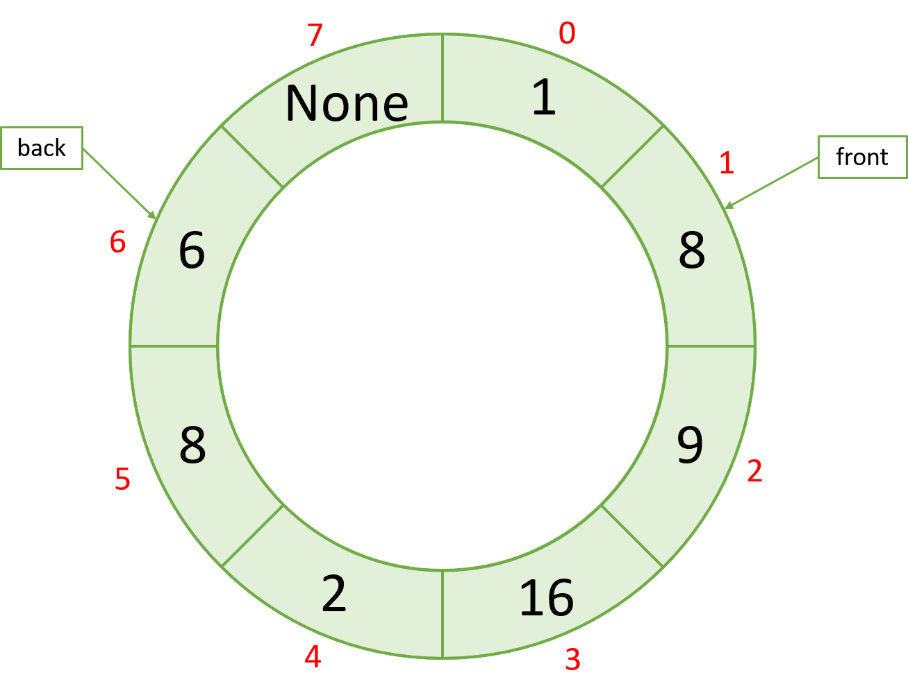
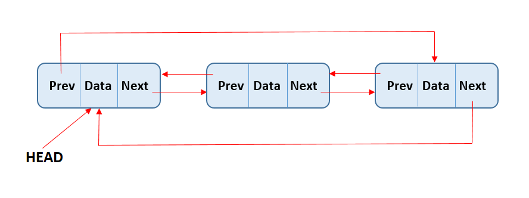

# Project 5: Circular Double-Ended Queues (Deque)

**Due: Thursday, November 2 @ 9:00 PM ET**

_This is not a team project, do not copy someone else’s work._

-------------------
# Assignment Overview

__

In a typical FIFO (First in First out) queue, elements are added to one end of the underlying structure and removed from the opposite. These are natural for storing sequences of instructions: Imagine that instructions are added to the queue when first processed, and removed when completed. The first instruction processed will also be the first completed - we add it to the front, and remove it from the back.

A deque is a [double-ended queue](https://en.wikipedia.org/wiki/Double-ended_queue), meaning elements can be added or removed from either end of the queue. This generalizes the behavior described above to account for more complex usage scenarios. The ability to add or remove from both ends of the deque allows the structure to be used as both a FIFO queue and a LIFO stack, simultaneously.

This structure is useful for storing undo operations, where more recent undos are pushed and popped from the top of the deque and old/expired undo are removed from the back of the deque. Trains, consisting of sequences of cars, can also be thought of as deques: cars can be added or removed from either end, but never the middle.

A circular queue is a queue of fixed size with end-to-end connections. This is a way to save memory as deleted elements in the queue can simply be overwritten. In the picture above at index 0, element 1 has been removed (dequeued) from the queue but the value remains. If two new values are enqueued, then that 1 will be overwritten. After this, the circular queue will have reached capacity, and need to grow.

Circular queues are useful in situations with limited memory. Consider a router in an internet network. A package (a set of bits sent across the network) is sent to this router and it joins the router's processing queue. This router can only hold so many packets before it has to start dropping some. A circular queue would be useful here, as it optimizes memory usage.

A circular deque is a combination of a deque and a circular queue. It sets a max size and can grow and shrink like a circular queue, and it can enqueue/dequeue from both ends.

There are many equivalent implementations of circular deques, each with their own rationale and use cases. For this project you will implement a circular deque using both a circular array and a circular doubly linked list (CDLL) as underlying structures. A function, **plot\_speed**, is provided for comparison of the two structures.

Assignment Notes
----------------

TIPS:
----------------

*   The use of [modulo (%)](https://docs.python.org/3/reference/expressions.html#binary-arithmetic-operations) is highly recommended
*   Understand what [amortized runtime](https://medium.com/@satorusasozaki/amortized-time-in-the-time-complexity-of-an-algorithm-6dd9a5d38045) is(also explained below).
*   Enqueue and Dequeue both have basic tests which test their functionality in conditions where shrink and grow will not be called. This allows you to test your enqueue and dequeue functions without having to implement grow/shrink.
*   Although the API lists enqueue/dequeue first, it is common to implement grow/shrink and then enqueue/dequeue or grow->enqueue then shrink->dequeue. The test cases are designed to allow you to implement these functions independently in the order which best suits you.

RULES:
----------------

*   The use of Python's Queues library is **NOT ALLOWED** and any use of it will result in a 0 on this project
*   The use of .pop() is **PROHIBITED.**
    *   Any function using .pop() will be deducted all points for test cases and manual grading
    *   .pop(x) has a runtime of _O(n-x)_, where _n_ is the length of the python list .pop(x) is called on - in most situations, this will violate time complexity. 
*   Use of the **nonlocal** keyword will result in a 0 on the function is used on
    *   You should never need to use this keyword in this project and if you are using it in a function in this class, you're doing something wrong.

Assignment Specifications
-------------------------

#### class CircularDeque:

_DO NOT MODIFY the following attributes/functions_

*   **Attributes**
    *   **capacity: int:** the total amount of items that can be placed in your circular deque. This grows and shrinks dynamically, but is never less than 4. Will always be greater than or equal to ;**size**.
    *   **size: int:** the number of items currently in your circular deque
    *   **queue: list\[T\]:** The underlying structure holding the data of your circular deque. Many elements may be **None** if your current **size** is less than **capacity**. This grows and shrinks dynamically.
    *   **front: int:** an index indicating the location of the first element in the circular deque
    *   **back: int:** an index indicating the location of the last element in your circular deque
*   **\_\_init\_\_(self, data: list\[T\], front: int, capacity: int) -> None**
    *   Constructs a circular deque
    *   **data: list\[T\]:** a list containing all data to be inserted into the circular deque
    *   **front: int:** An index to offset the front pointer to test the circular behavior of the list without growing
    *   **capacity: int:** the capacity of the circular deque
    *   **Returns:** None
*   **\_\_str\_\_(self) -> str** and **\_\_repr\_\_(self) -> str**
    *   Represents the circular deque as a string
    *   **Returns:** str

_IMPLEMENT the following functions_

*   **\_\_len\_\_(self) -> int**
    *   Returns the length/size of the circular deque - this is the number of items currently in the circular deque, and will not necessarily be equal to the **capacity**
    *   This is a [magic method](https://www.tutorialsteacher.com/python/magic-methods-in-python) and can be called with **len(object\_to\_measure)**
    *   Time complexity: _O(1)_
    *   Space complexity: _O(1)_
    *   **Returns:** int representing length of the circular deque
*   **is\_empty(self) -> bool**  
    *   Returns a boolean indicating if the circular deque is empty
    *   Time complexity: _O(1)_
    *   Space complexity: _O(1)_
    *   **Returns:** True if empty, False otherwise
*   **front\_element(self) -> T**  
    *   Returns the first element in the circular deque
    *   Time complexity: _O(1)_
    *   Space Complexity: _O(1)_
    *   **Returns:** the first element if it exists, otherwise None
*   **back\_element(self) -> T**  
    *   Returns the last element in the circular deque
    *   Time complexity: _O(1)_
    *   Space complexity: _O(1)_
    *   **Returns:** the last element if it exists, otherwise None
*   **grow(self) -> None**
    *   Doubles the capacity of CD by creating a new underlying python list with double the capacity of the old one and copies the values over from the current list.
    *   The new copied list will be 'unrolled' s.t. the front element will be at index 0 and the tail element will be at index \[size - 1\]. 
    *   Time complexity: _O(n)_
img    *   Space complexity: _O(n)_
    *   **Returns:** None
*   **shrink(self) -> None**
    *   Cuts the capacity of the queue in half using the same idea as grow. Copy over contents of the old list to a new list with half the capacity.
    *   The new copied list will be 'unrolled' s.t. the front element will be at index 0 and the tail element will be at index \[size - 1\]. 
    *   Will never have a capacity lower than 4, **DO NOT** shrink when shrinking would result in a capacity <= 4
    *   Time complexity: _O(n)_
    *   Space complexity: _O(n)_
    *   **Returns:** None
*   **enqueue(self, value: T, front: bool = True) -> None:**  
    *   Add a value to either the front or back of the circular deque based off the parameter **front**
    *   if front is true, add the value to the front. Otherwise, add it to the back
    *   Call **grow()** if the size of the list has reached capacity
    *   **param value: T:** value to add into the circular deque
    *   **param value front:** where to add value T
    *   Time complexity: _O(1)\*_
    *   Space complexity: _O(1)\*_
    *   **Returns:** None
*   **dequeue(self, front: bool = True) -> T:**  
    *   Remove an item from the queue
    *   Removes the front item by default, remove the back item if False is passed in
    *   Calls **shrink()** If the current size is less than or equal to 1/4 the current capacity, and 1/2 the current capacity is greater than or equal to 4, halves the capacity.
    *   **param front:** Whether to remove the front or back item from the dequeue
    *   Hint: You shouldn't delete the value from the dequeue (by setting it to None) as that spot will merely be overwritten when you enqueue on that spot so it's more efficient to only adjust the back/front pointer instead.
    *   Time complexity: _O(1)\*_
    *   Space complexity: _O(1)\*_
    *   **Returns:** removed item, None if empty

\***[Amortized](https://medium.com/@satorusasozaki/amortized-time-in-the-time-complexity-of-an-algorithm-6dd9a5d38045)**. _Amortized Time Complexity_ means 'the time complexity a majority of the time'. Suppose a function has amortized time complexity _O(f(n))_ - this implies that the majority of the time the function falls into the complexity class _O(f(n)),_ however, there may exist situations where the complexity exceeds _O(f(n))._ The same logic defines the concept of _Amortized Space Complexity_.

Example:  enqueue(self, value: T, front: bool)has an amortized time complexity of _O(1)_: In the majority of situations, enqueueing an element occurs through a constant number of operations. However, when the Circular Deque is at capacity, grow(self) is called - this is an _O(n)_ operation, therefore in this particular scenario, enqueue exceeds its amortized bound.

##  The Application Overview: The Great List Rebellion

In an era where Python has been deemed the universal language, a shift occurred in the techno-economic landscape. Python lists were patented by the Grand Coalition of Tech Titans (GCTT) - a conglomerate of all major tech companies led by Microsoft, Amazon, Google, Meta, and others. This patented technology became the crown jewel, and any use of Python lists required hefty licensing fees, filling the coffers of the already powerful corporations.

To enforce this, the GCTT painted a grand narrative: Lists were the epitome of efficiency and elegance, the ultimate data structure. All others were substandard. As a result, the use of deques with lists became the mainstream norm. It was profitable, it was popular, but for many, it wasn't efficient.

But not everyone was swayed by this corporate onslaught. In the underground world of data structures and algorithms, murmurs of a revolution began. The Resistance was born, a group of radical thinkers who believed in the power of doubly linked lists. They were the guardians of knowledge, the ones who saw through the corporate veil. To them, deques should be written using doubly linked lists, not the licensed, inefficient lists.

You, a fresh graduate with dreams and hopes, unknowingly walk into this whirlwind. Hired by a tech startup, Neoteric Nodes, you're introduced to its enigmatic CEO: S. Omsae, known in the Resistance circles as the "Deque Purist". The Resistance's battle wasn't just ideological; it was deeply personal for S. Omsae. 

Your initiation was immediate. Handed the task of creating a _better_ Circular Deque class, the stakes were clear: Use a list, and your career at Neoteric Nodes would be shorter than a list with a single element.

Your onboarding crew showed you their most important piece of work so far: The **CDLL (Circular Doubly Linked List)**. Imperfect but revolutionary, it was the Resistance's answer to the Python list monopoly.

Throughout this project, you should help The Resistance by designing a **Circular Deque** that uses the **CDLL** as its underlying structure, which you decide to call the **CDLLCD**, as shown below. Oh, and you should think of a better name for it.

You are given the classes described below. **DO NOT** modify these classes - any modification will result in a zero for this portion of the project.

**class CDLLNode**

_DO NOT MODIFY the following attributes/functions_

*   **Attributes:**
    *   **val: T:** value stored by the node
    *   **next: CDLLNode:** The next node in the **CDLL**
    *   **prev: CDLLNode:** The previous node in the **CDLL**
*   **\_\_init\_\_(self, val: T, next: CDLLNode = None, prev: CDLLNode = None) -> None**
    *   Constructs a **CDLLNode**
    *   **param val:** value stored by the node
    *   **param next: CDLLNode:** The next node in the **CDLL**
    *   **param prev: CDLLNode:** The next node in the **CDLL**
    *   **return: None**
*   **\_\_eq\_\_(self, other: CDLLNode) -> bool**
    *   Compares two **CDLLNode** objects by value
    *   **param other: CDLLNode:** The other node
    *   **return:** True if the comparison is true, else false
*   **\_\_str\_\_(self) -> str**
    *   returns a string representation of the **CDLLNode**
    *   **return:** a string

**class CDLL:**

> A circular doubly linked list is a doubly linked list where the **tail node points to the head node, and the head node points to the tail node** (although `CDLLNode` does not store the tail explicitly). This allows for traversal in both directions, and the ability to traverse the entire list starting from any node.

_DO NOT MODIFY the following attributes/functions_

*   **Attributes:**
    *   **head: CDLLNode:** The head of the **CDLL**
    *   **size: int:**  the number of nodes in the **CDLL**
*   **\_\_init\_\_(self) -> None**  
    *   Creates a **CDLL**
    *   **return: None**
*   **\_\_eq\_\_(self, other: CDLL) -> bool:**
    *   Compares two **CDLL** objects by value
    *   **param other: CDLL:** the other list to compare
    *   **return:** True if the comparison is true, else false
*   **\_\_str\_\_(self) -> str**  
    *   returns a string representation of the **CDLL**
    *   **return:** a string

**You are required to implement the following two functions to achieve a Circular Doubly Linked List:**

*   **insert(self, val: T, front: bool = True) -> None:**
    *   inserts a node with value **val** in the front or back of the **CDLL**
        * Don't forget to keep it _circular_!!
    *   **param val: T:** the value to insert
    *   **param front: bool = True:**  whether to insert in the front of the list, or the back.
    *   Time Complexity: _O(1)_ 
    *   Space Complexity: _O(1)_
    *   **return: None**
*   **remove(self, front: bool = True) -> None:**
    *   removes a node from the **CDLL**
        * Don't forget to keep it _circular_!!
    *   If the list is empty, do nothing
    *   **param front: bool = True:** whether to remove from the front of the list, or the back
    *   Time Complexity: _O(1)_
    *   Space Complexity: _O(1)_
    *   **return: None**

Earlier in this project, you created a **Circular Deque** using a list as the underlying structure. Your mission for this part of the application problem is to reimplement the functionality of **CircularDeque** with a **CDLL** as the underlying structure.

**class CDLLCD:**

_DO NOT MODIFY the following attributes/functions_
*   **Attributes:**
    *   **CDLL: CDLL:** The underlying structure of the **CDLLCD**
*   **\_\_init\_\_(self) -> None**
    *   Creates a **CDLL** object to be used as the underlying structure of the **CDLLCD**
    *   **return: None**
*   **\_\_eq\_\_(self, other: CDLLCD) -> bool**
    *   Compares two **CDLLCD** objects by value
    *   **param other:**  the other **CDLLCD**
    *   **return:** True if the comparison evaluates to true, else false
*   **\_\_str\_\_(self) -> str:**  
    *   Returns a string representation of the **CDLLCD**
    *   **return:** a string

**You are required to implement the following functions:**

_Note: All of these functions should be fairly short and straightforward. If you find yourself writing a lot of code, you're probably doing something wrong._

*   **\_\_len\_\_(self) -> int**
    *   Returns the length/size of the CDLLCD, and hence the underlying CDLL.
    *   This is a [magic method](https://www.tutorialsteacher.com/python/magic-methods-in-python) and can be called with **len(object\_to\_measure)**
    *   Time complexity: _O(1)_
    *   Space complexity: _O(1)_
    *   **Returns:** int representing length of the CDLLCD
*   **is\_empty(self) -> bool**  
    *   Returns a boolean indicating if the CDLLCD is empty
    *   Time complexity: _O(1)_
    *   Space complexity: _O(1)_
    *   **Returns:** True if empty, False otherwise
*   **front\_element(self) -> T**  
    *   Returns the first element in the CDLLCD
    *   Time complexity: _O(1)_
    *   Space Complexity: _O(1)_
    *   **Returns:** the first element if it exists, otherwise None
*   **back\_element(self) -> T**  
    *   Returns the last element in the CDLLCD
    *   Time complexity: _O(1)_
    *   Space complexity: _O(1)_
    *   **Returns:** the last element if it exists, otherwise None
*   **enqueue(self, val: T, front: bool = True) -> None**
    *   Adds a value to the **CDLLCD**
    *   Must use the **insert** function of the **CDLL** class
    *   **param val: T:** the value to be added
    *   **param front: bool = True:** whether to add to the front or the back of the deque
    *   Time complexity: _O(1)_
    *   Space complexity: _O(1)_
    *   **return: None**
*   **dequeue(self, front: bool = True) -> T**
    *   Removes a value from the deque, returning it
    *   Must use the **remove** function of the **CDLL** class
    *   **param front: bool = True:** whether to remove from the front or the back of the deque
    *   Time complexity: _O(1)_
    *   Space complexity: _O(1)_
    *   **return: The dequeued element, None if empty**

Guarantees/Notes
----------------
* _Wait, what is a **CDLLCD** again?_ A **CDLLCD** is a circular deque that uses a circular doubly linked list (**CDLL**) as its underlying structure, instead of a list (like the **CircularDeque** class you implemented earlier). Both the **CircularDeque** and **CDLLCD** behave in the same way. Can you think why the **CDLLCD** might be more or less efficient than the **CircularDeque** implemented with a list?
*   You must actually use the underlying **CDLL** when implementing the **CDLLCD** functions. The testcase check for this, but attempting to get around the checks will result in a zero for all tests and manual grading related to the application problem.
*   Once completed, try running the function **plot\_speed** to see how your implementation compares to the main project implementation. They should be pretty close.

# **Submission Guidelines**

### **Deliverables:**

For each project, a `solution.py` file will be provided. Ensure to write your Python code within this file. For best results:
- 📥 **Download** both `solution.py` and `tests.py` to your local machine.
- 🛠️ Use **PyCharm** for a smoother coding and debugging experience.

### **How to Work on a Project Locally:**

Choose one of the two methods below:

---

#### **APPROACH 1: Using D2L for Starter Package**
1. 🖥️ Ensure PyCharm is installed.
2. 📦 **Download** the starter package from the *Projects* tab on D2L. *(See the tutorial video on D2L if needed)*.
3. 📝 Write your code and, once ready, 📤 **upload** your `solution.py` to Codio. *(Refer to the D2L tutorial video for help)*.

---

#### **APPROACH 2: Directly from Codio**
1. 📁 On your PC, create a local folder like `Project01`.
2. 📥 **Download** `solution.py` from Codio.
3. 📥 **Download** `tests.py` from Codio for testing purposes.
4. 🛠️ Use PyCharm for coding.
5. 📤 **Upload** the `solution.py` back to Codio after ensuring the existing file is renamed or deleted.
6. 🔚 Scroll to the end in Codio's Guide editor and click the **Submit** button.

---

### **Important:**
- Always **upload** your solution and **click** the 'Submit' button as directed.
- All project submissions are due on Codio. **Any submission after its deadline is subject to late penalties** .
  
**Tip:** While Codio can be used, we recommend working locally for a superior debugging experience in PyCharm. Aim to finalize your project locally before submitting on Codio.

#### **Grading**

The following 100-point rubric will be used to determine your grade on this project:

*   Tests (70)  
    *   01 - len(): \_\_/2
    *   02 - is\_empty: \_\_/2
    *   03 - front\_element: \_\_/2
    *   04 - back\_element: \_\_/2
    *   05 - front\_enqueue\_basic: \_\_/2
    *   06 - back\_enqueue\_basic: \_\_/2
    *   07 - front\_enqueue: \_\_/5
    *   08 - back\_enqueue: \_\_/5
    *   09 - front\_dequeue\_basic: \_\_/2
    *   10 - back\_dequeue\_basic: \_\_/2
    *   11 - front\_dequeue: \_\_/5
    *   12 - back\_dequeue: \_\_/5
    *   13 - grow: \_\_/4
    *   14 - shrink: \_\_/4
    *   15 - Comprehensive: \_\_/0
    *   16 - Application: \_\_/26
        * CDLL: \_\_/12
            * 17 - insert: \_\_/6
            * 18 - remove: \_\_/6
        * CDLLCD: \_\_/14
            * 19 - len: \_\_/1
            * 20 - is\_empty: \_\_/1
            * 21 - front\_element: \_\_/2
            * 22 - back\_element: \_\_/2
            * 23 - enqueue: \_\_/4
            * 24 - dequeue: \_\_/4
        * Application\_comprehensive: \_\_/0

**Note on Comprehensive Testing:**

We have included a comprehensive test for each function, which is worth 0 points. We **strongly recommend** you to utilize these tests as they are designed to thoroughly check your functions for any logical flaws. While these tests do not directly contribute to your score, if your solution fails to pass a comprehensive test for a specific function during our assessment, **half of the manual points allocated for that function will be deducted**. This is to emphasize the importance of not only meeting basic requirements but also ensuring robustness and correctness in your code. Consider these comprehensive tests as tools for ensuring quality and resilience in your solutions.

Certainly! Here's the additional note:

**Additional Note on Scenario Generation:**

While we make every effort to generate test cases that encompass every possible scenario, there might be times when some edge cases are inadvertently overlooked. Nevertheless, should we identify any scenario where your submitted logic doesn't hold, even if it's not part of our provided test cases, we reserve the right to deduct from the manual points. This highlights the significance of crafting logic that doesn't merely pass the given tests, but is genuinely resilient and correctly addresses the problem's entirety. Always strive to think beyond the provided cases, ensuring that your solutions are comprehensive and robust.

*   Manual (30)
    * Time and Space complexity points are divided equally for each function. If you fail to meet time or space complexity in a given function, you receive half of the manual points for that function.
    * Loss of 1 point per missing docstring (max 5 point loss)
    * Loss of 2 points per changed function signature (max 20 point loss)
    * We reserve the right to deduct points for any other issues we find in your code.
    *   M0 - len(): \_\_/1
    *   M1 - is\_empty: \_\_/1
    *   M2 - front\_element: \_\_/1
    *   M3 - back\_element: \_\_/1
    *   M4 - grow: \_\_/3
    *   M5 - shrink: \_\_/3
    *   M6 - front\_enqueue: \_\_/2
    *   M7 - back\_enqueue: \_\_/2
    *   M8 - front\_dequeue: \_\_/2
    *   M9 - back\_dequeue: \_\_/2
    *   M10 - application: \_\_/12:
        * CDLL: \_\_/6
            * M11 - insert: \_\_/3
            * M12 - remove: \_\_/3
        * CDLLCD: \_\_/6
            * M13 - len: \_\_/0.5
            * M14 - is\_empty: \_\_/0.5
            * M15 - front\_element: \_\_/0.5
            * M16 - back\_element: \_\_/0.5
            * M17 - enqueue: \_\_/2
            * M18 - dequeue: \_\_/2

- **Docstrings** are not provided for this project. Please use Project 1 as a template for your docstrings.
  To learn more on what docstrings are, visit the following website: [What are Docstrings?](https://peps.python.org/pep-0257/)

  - Each missing docstring is a 1 point deduction
  - Up to 5 points of deductions

_Project by Gabriel Sotelo. Inspired by the work of Jacob Caurdy and Andrew Haas_

<input type="checkbox"> <b>STEP 1 :Rename the old solution file by clicking Rename button below. This button renames your file to **solution_old.py** </b>
{Rename}(mv solution.py solution_old.py)
<input type="checkbox"> <b>STEP 2 : Refresh your file tree by clicking on the refresh button under project name or refresh your browser. </b>

<input type="checkbox"> <b>STEP 3 : Upload your **solution.py** from your computer to Codio File Tree on the left. Refresh your file tree or browser to see if it actually updated the solution.py </b>

<input type="checkbox"> <b>STEP 4:Submit your code, by clicking the Submit button, you can submit as many times as you like, no limit on submission. 

Submit button is tied to tests.py in our secure folder, and it always gets the updated version of the tests.py. In case of any tests.py update, students will always get the latest version to test their code through the submit button. 
{SUBMIT!|assessment}(test-3379255259)
Please note that there will be manual grading after you submit your work. Clicking Submit only runs the Auto-grader for the test cases. Manual Grading is 30 points in this project. (28 pts for Run Time and Space complexity, +2 points for filling out the feedback and the citation text box)

<input type="checkbox"> <b>STEP 5: Please make sure to **scroll all the way down on Guide Editor page**, Guide is the specs document, it is the document you are reading right now, scroll all the way down, and **click at the Mark as Completed button**, see below for the image of the button so you know what it looks like. Please scroll down and actually push the button. If you do not mark complete yourself, Codio will mark it at the end of the last penalty day, which will give 0 to your project. </b>

{Check It!|assessment}(grade-book-3266829715)
{Submit Answer!|assessment}(free-text-3024451938)

